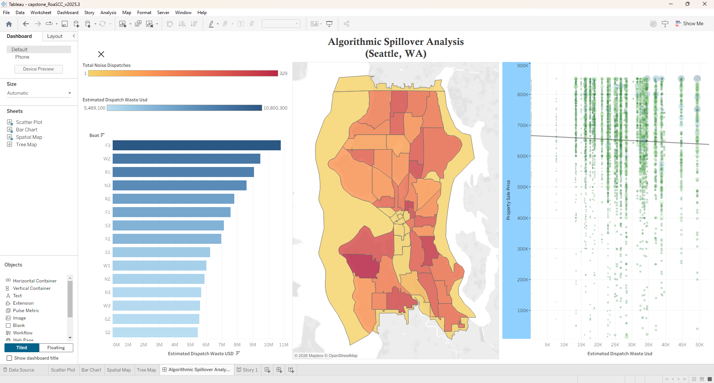
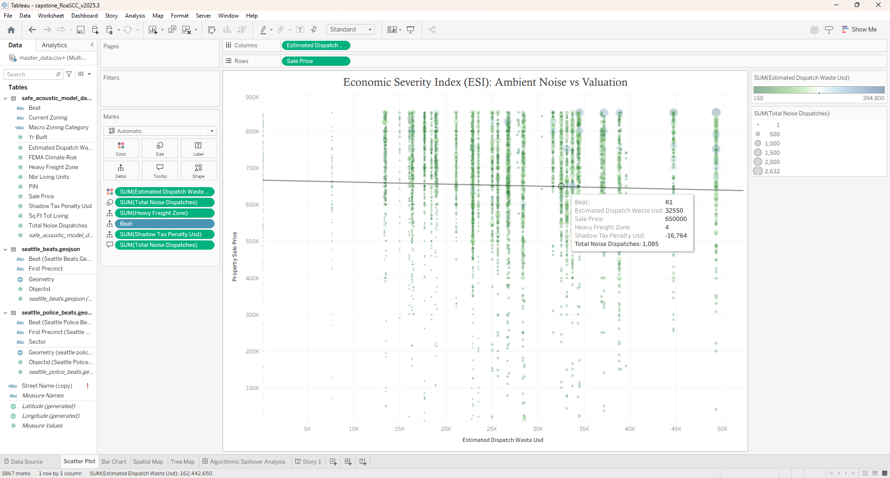
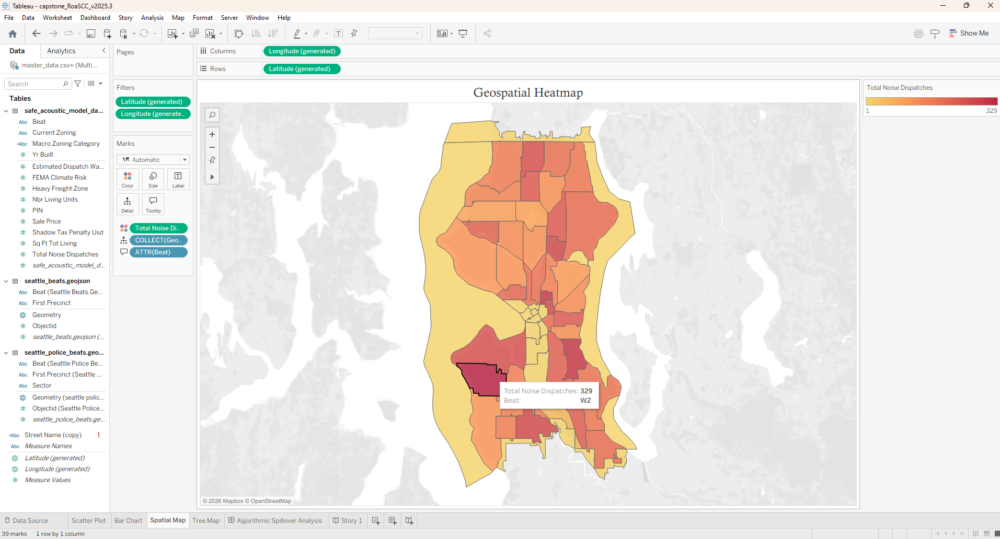

# Seattle World Cup Spillover Effect
This project involves developing a thorough data pipeline and conducting detailed statistical analysis to understand how rerouting heavy freight during the Seattle World Cup can impact the economy. It's an exciting effort to uncover valuable insights and inform future decisions.

## Project Overview
In the summer of 2026, Seattle will host the FIFA World Cup, bringing an unprecedented surge in tourism to the city's infrastructure. This project analyzes a critical logistical vulnerability:

**What is the economic impact on residential neighborhoods if major freight highways fail during this mega-event?**

When primary supply chain routes break down, navigation algorithms (like Google Maps and Waze) automatically reroute heavy commercial trucks through residential areas—a phenomenon known as **algorithmic spillover**. This creates severe acoustic pollution, spikes municipal dispatch volumes, and impacts property values through a hypothesized **"Shadow Tax."**

This project quantifies that localized impact and deploys a predictive valuation model to help municipal authorities make data-driven logistics and infrastructure decisions.

---

## Architecture & Tech Stack
This end-to-end data pipeline integrates disparate government datasets into a cloud-ready predictive engine.

* **Data Engineering (ETL):** Python (requests, pandas, geopandas). Extracted recent 911 dispatch logs from the Seattle Open Data API, merged with King County Assessor records, WSDOT freight corridors, and FEMA climate risk scores.

* **Geospatial Processing:** Engineered a universal 10-digit Parcel Identification Number (PIN) and utilized R-Tree spatial intersections to map properties to active Heavy Freight buffers.

* **Statistical Modeling & ML:** Python (scipy, statsmodels, scikit-learn). Utilized a Welch's Two-Sample T-Test, Ordinary Least Squares (OLS) Hedonic Pricing Regression, and optimized tree-based machine learning models (Gradient Boosting, Random Forest).

* **Cloud Deployment:** Data batches were programmatically ingested into a **Supabase (PostgreSQL)** cloud database.
* **Business Intelligence:** Interactive dashboards and presentation storyboards designed in **Tableau**.

---

## Key Findings

### 1. Diagnosing Omitted Variable Bias (OVB)
Initial descriptive modeling aimed to isolate an acoustic "Shadow Tax" penalty. However, the Ordinary Least Squares (OLS) regression and subsequent scatter plot analyses revealed a classic case of **Omitted Variable Bias (OVB)**. The anticipated penalty from algorithmic spillover was mathematically offset by the premium buyers pay to live in dense, amenity-rich urban centers.

### 2. Geospatial Impact & Municipal Waste

While home prices were shielded by the density premium, the spatial intersection proved a massive drain on municipal resources. Rerouted commercial traffic triggered significant spikes in non-emergency dispatches across specific logistical chokepoints.

### 3. Predictive Machine Learning

A machine learning pipeline was constructed to forecast home values using strictly structural and environmental features. The **Gradient Boosting Regressor** outperformed other models (with 300 estimators and a max depth of 5 to handle right-skewed pricing distributions), demonstrating that environmental profiles alone have significant predictive power for baseline property equity.

---

## Interactive Deliverables

**1. The Tableau Dashboard**

For a deep dive into the data, an interactive Tableau Packaged Workbook is included in this repository.

* Download `capstone_RoaSCC_v2025.3.twbx` from the repository files.

* Open it using the free [Tableau Reader](https://www.tableau.com/products/reader) to explore the spatial heatmaps and statistical distributions locally.

**2. The Python Pipeline**

* **`01_data_engineering.ipynb`**: Contains the API extractions, string manipulation for a universal PIN generation, and GeoPandas spatial joins.

* **`02_statistical_modeling.ipynb`**: Contains the baseline variance testing, OLS regression, OVB diagnosis, and the Gradient Boosting machine learning architecture.
